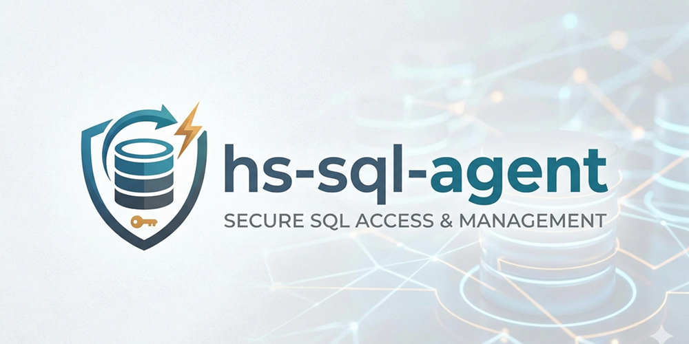
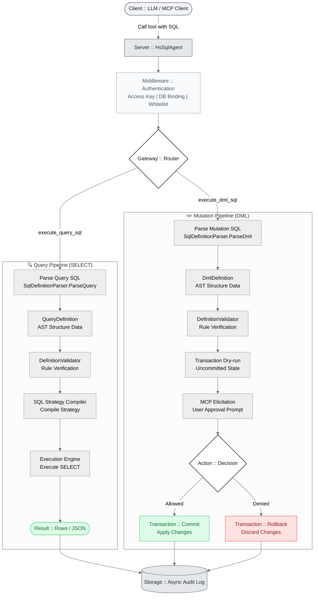

# hs-sql-agent

> **A high-performance MCP server for secure SQL access and enterprise governance.**



[](https://github.com/tse-wei-chen/hs-sql-agent/blob/main/LICENSE) [](https://github.com/tse-wei-chen/hs-sql-agent/actions/workflows/docker-publish.yml) [](https://www.nuget.org/packages/HsSqlAgent.Server) [](https://github.com/tse-wei-chen/hs-sql-agent/actions/workflows/codeql.yml) [](https://github.com/tse-wei-chen/hs-sql-agent/actions/workflows/test.yml) [](https://zeabur.com/templates/RFPWDU)

`hs-sql-agent` connects MCP clients to SQLite, PostgreSQL, MySQL, SQL Server, Oracle, and Firebird through an HTTP MCP endpoint and a built-in Admin Panel.

## Why hs-sql-agent?

Instead of executing unrestricted LLM-generated SQL, the server parses supported SQL into structured definitions, validates it, and rebuilds the final statement through a provider-specific SQL compiler.

- **Six database providers** — SQLite, PostgreSQL, MySQL, SQL Server, Oracle, and Firebird.
- **Governed access** — Per-key database binding, table whitelisting, CORS, rate limits, and execution policies.
- **Safe DML** — Transactional dry-run followed by MCP Elicitation for explicit human approval.
- **Admin Panel** — Manage databases, keys, roles, custom tools, audit records, and runtime policies.
- **Enterprise ready** — OIDC SSO, TOTP MFA, audit retention, Prometheus metrics, OTLP, and webhook/SIEM delivery.
- **Semantic metadata** — Table and column synonyms, relationships, and scoped metric metadata for schema discovery.

SQL support is intentionally bounded: unsupported syntax is rejected instead of silently changing its meaning. See the [MCP Tools Reference](https://github.com/tse-wei-chen/hs-sql-agent/wiki/MCP-Tools-Reference) for the supported SQL contract.

## Quick Start

```bash
cp .env.example .env
# Set HMAC_KEY and JWT_KEY to unique secrets of at least 32 bytes.
docker compose up -d
```

Open the Admin Panel at <http://localhost:8080>. Configuration options and production deployment guidance are documented in the [Wiki](https://github.com/tse-wei-chen/hs-sql-agent/wiki).

## Use with an MCP client

Create an MCP key in the Admin Panel. The key dialog displays the plaintext secret once and generates configuration for Claude Desktop, Cursor, and generic Streamable HTTP clients.

Set `MCP_PUBLIC_ENDPOINT` to the externally reachable MCP URL, including `/mcp`. For client compatibility, onboarding, and DML Elicitation requirements, see [MCP client onboarding](docs/mcp-onboarding.md).

## NuGet for existing .NET APIs

Embed the MCP SQL Agent and optional Admin UI in an ASP.NET Core application:

```bash
dotnet add package HsSqlAgent.Server
```

```csharp
builder.Services.AddHsSqlAgent(options => { ... });
app.UseHsSqlAgent();                    // API only
// app.UseHsSqlAgent().ServeAdminUi();  // API and Admin UI
```

See the [NuGet Package guide](https://github.com/tse-wei-chen/hs-sql-agent/wiki/NuGet-Package) for configuration and deployment details.

## How SQL execution works

1. Authenticate the MCP key and apply its database, table, and policy scope.
2. Parse supported SQL into a structured definition.
3. Validate the definition and compile it for the configured database provider.
4. Execute queries within configured limits.
5. For DML, dry-run in a transaction and require human approval through MCP Elicitation before commit.

Custom SQL tools pass through the same parser, validation, access policy, and execution limits as built-in tools. Lifecycle, parameter, and publishing rules are documented in the [Admin Panel guide](https://github.com/tse-wei-chen/hs-sql-agent/wiki/Admin-Panel).

## Documentation

| Topic | Documentation |
|---|---|
| Getting started | [Getting Started](https://github.com/tse-wei-chen/hs-sql-agent/wiki/Getting-Started) |
| Configuration | [Configuration](https://github.com/tse-wei-chen/hs-sql-agent/wiki/Configuration) |
| Admin Panel | [Admin Panel](https://github.com/tse-wei-chen/hs-sql-agent/wiki/Admin-Panel) |
| MCP tools and SQL support | [MCP Tools Reference](https://github.com/tse-wei-chen/hs-sql-agent/wiki/MCP-Tools-Reference) |
| Security, OIDC, and MFA | [Security Governance](https://github.com/tse-wei-chen/hs-sql-agent/wiki/Security-Governance) |
| Deployment and observability | [Deployment](https://github.com/tse-wei-chen/hs-sql-agent/wiki/Deployment) · [Distributed Deployment](https://github.com/tse-wei-chen/hs-sql-agent/wiki/Distributed-Deployment) |
| API | [API Reference](https://github.com/tse-wei-chen/hs-sql-agent/wiki/API-Reference) |
| Troubleshooting | [Troubleshooting](https://github.com/tse-wei-chen/hs-sql-agent/wiki/Troubleshooting) |
| Development | [Development](https://github.com/tse-wei-chen/hs-sql-agent/wiki/Development) |


## SQL Execution Flow



### DML Approval Prompt

This is what the human-in-the-loop approval step looks like during `execute_dml_sql`:


## Contributing

See [CONTRIBUTING.md](CONTRIBUTING.md) and the [Development guide](https://github.com/tse-wei-chen/hs-sql-agent/wiki/Development).

## License

[Apache License 2.0](LICENSE)
