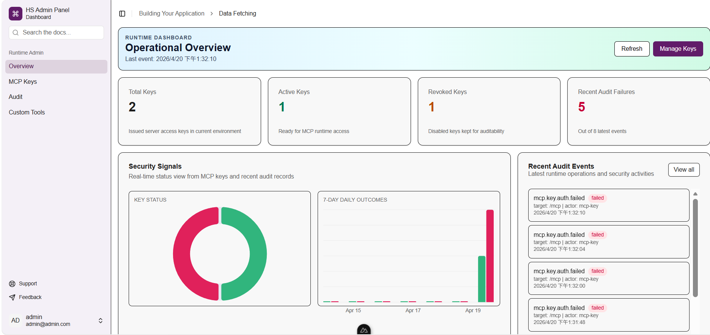
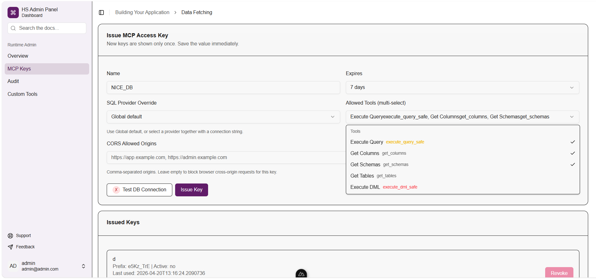
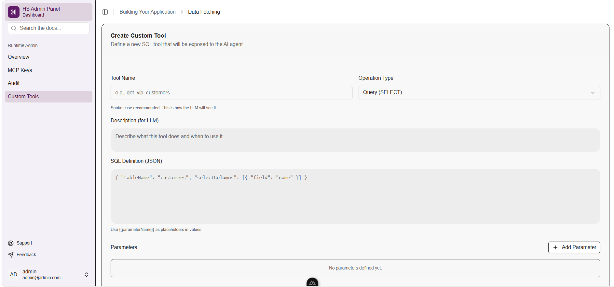

# ⚡ hs-sql-agent (High-Speed SQL Agent)

> **The high-performance MCP server designed for instant SQL interaction and secure enterprise governance.**

 [](https://github.com/tse-wei-chen/hs-sql-agent/actions/workflows/docker-publish.yml) [](https://github.com/tse-wei-chen/hs-sql-agent/actions/workflows/codeql.yml)

`hs-sql-agent` is a robust HTTP MCP server for relational databases that bridges the gap between AI agents and your data. Unlike "black-box" generic SQL agents, `hs-sql-agent` provides a **High-Speed** execution engine with a **Built-in Admin Panel** to ensure every AI-generated query is managed, audited, and secure.

---

## ✨ Key Features

### 🚀 High-Speed & Universal Access

- **Instant Interaction**: Optimized C# backend ensures ultra-low latency for schema discovery and query execution.
- **Universal Database Support**: One agent for all — supports `Sqlite`, `Postgres`, `Mysql`, `SqlServer`, `Oracle`, and `FireBird`.
- **Structured Querying**: Powered by [SqlKata](https://sqlkata.com) for reliable and safe SQL construction.

### 🛡️ Enterprise-Grade Governance

- **Built-in Admin Web UI**: Manage your SQL Agent visually. No more manual JSON configuration files.
- **Granular Security Control**:
  - **Key-Level Mapping**: Assign specific database connections to individual API keys.
  - **Lifecycle Management**: Effortlessly issue, list, or revoke access keys in real-time.
- **Guardrails & Safety**:
  - **Global Rate Limiting**: Prevent your database from being overwhelmed by AI loops or excessive traffic.
  - **Comprehensive Audit Logs**: Track every single query with daily summaries and detailed execution history.
- **Customization**:
  - **Custom SQL Tools**: Define domain-specific SQL queries and DML statements to be exposed to the AI agent.

---

## 🖥️ Admin Panel

The built-in Admin Panel allows you to monitor operations and manage access without touching a single configuration file.


_Operational Dashboard: Monitor keys and audit events in real-time._


_Granular Control: Assign specific database connections and tool subsets to each API key._


_Low-Code Tools: Define custom SQL operations (e.g., `calculate_churn_rate`) for the AI agent._

---

## 🚀 Quick Start (Docker Compose)

The easiest way to run **HS SQL Agent** is using Docker Compose. This ensures your configuration is saved and your data persists across restarts.

### 1. Setup Configuration

Copy the example environment file:

```bash
cp .env.example .env
```

Edit the `.env` file to set your secret keys:

```env
HMAC_KEY=YourMcpHmacSecretKeyHere-AtLeast32Bytes!
JWT_KEY=YourSuperSecretKeyHere-AtLeast32Bytes!
JWT_ISS=HS-Agent
JWT_AUD=HS-Agent-Users
JWT_ACCESS_TOKEN_EXPIRATION_MINUTES=1
JWT_REFRESH_TOKEN_EXPIRATION_DAYS=30
RATE_LIMITING_PERMIT_LIMIT=0
RATE_LIMITING_WINDOW_SECONDS=0
RATE_LIMITING_QUEUE_LIMIT=0
```

> [!IMPORTANT]
> **Security Note:** Never use example keys in production. Replace `HMAC_KEY` and `JWT_KEY` with unique, 32+ byte strings.

### 2. Launch the Application

```bash
docker-compose up -d
```

### 3. Access the Service

- **Admin Panel:** `http://localhost:8080`
- **MCP Endpoint:** `http://localhost:8080/mcp`

---

## 🏗️ Architecture

- **Backend**: ASP.NET Core (`net10.0`) - High-performance server and MCP tool logic.
- **Frontend**: Nuxt 4 - Premium administrative dashboard.
- **Storage**: SQLite - Local persistent store for keys, logs, and custom tool definitions.

---

## 🗺️ Roadmap & Capabilities

### MCP Tools

Ready for use (Experimental Stage). You can also define your own tools in the Admin Panel!

| Progress | Tool                 | Description                                                               |
| :------- | :------------------- | :------------------------------------------------------------------------ |
| 🧪       | `execute_query_safe` | Execute a query (supports join, where, order by, group by, limit)         |
| 🧪       | `get_columns`        | Get column names and data types of a table                                |
| 🧪       | `get_schemas`        | Get schemas in the database                                               |
| 🧪       | `get_tables`         | Get tables in the database                                                |
| 🧪       | `execute_dml_safe`   | Execute a DML statement (INSERT, UPDATE, DELETE) with safety confirmation |

### Admin & Security

| Progress | Feature              | Description                                   |
| :------- | :------------------- | :-------------------------------------------- |
| ✅       | `Allowed Tools`      | Manage tool access for each API key           |
| ✅       | `Per-key Connection` | Override database settings for specific keys  |
| ✅       | `Key Management`     | Issue, list, and revoke keys in real-time     |
| ✅       | `Audit Logging`      | Detailed query execution history and metadata |
| ✅       | `Rate Limiting`      | Global and per-key rate limiting              |

---

## 📒 How to Use

### First-time Setup

1. Start the services and open `http://localhost:8080`.
2. Create the first admin account and sign in.
3. Go to **MCP Keys** and click `Issue Key`.
4. Copy the **Key Value** (only shown once) and add it to your client config.

### Client Configuration

Add the following to your MCP client configuration (e.g., `claude_desktop_config.json`):

```json
{
	"mcpServers": {
		"hs-sql-agent": {
			"url": "http://localhost:8080/mcp",
			"headers": {
				"X-MCP-Server-Key": "<YOUR_MCP_KEY>"
			}
		}
	}
}
```

_Works with **Claude Desktop**, **VS Code (Cline/Roo)**, and **Cursor**._

---

## 🛠️ Detailed Tool Information

<details>
<summary><b>Data Query (DQL)</b></summary>

- **execute_query_safe**
  - **Description**: Execute a complex query (supports joins, grouping, CTEs, etc.).
  - **Parameters**: `tableName`, `selectColumns`, `whereConditions`, `joins`, `groupBy`, etc.
  - **Read-only**: True

- **get_columns**
  - **Description**: Get column names and types for a specific table.
  - **Read-only**: True

- **get_tables / get_schemas**
  - **Description**: Discover the database structure.
  - **Read-only**: True

</details>

<details>
<summary><b>Data Manipulation (DML)</b></summary>

- **execute_dml_safe**
  - **Description**: Execute INSERT, UPDATE, or DELETE with a two-step confirmation process.
  - **Safety**: Requires a `ConfirmToken` from a dry-run call before committing changes.
  - **Read-only**: False

</details>

---

## 🏠 Local Development

### Prerequisites

- [.NET 10 SDK](https://dotnet.microsoft.com/download)
- [Node.js 20+](https://nodejs.org/)
- [pnpm](https://pnpm.io/)

### Setup

1. **Clone**: 
```bash
git clone https://github.com/tse-wei-chen/hs-sql-agent.git
```
2. **Backend**:
```bash
cp backend/src/ToolBox/appsettings.Example.json backend/src/ToolBox/appsettings.json
dotnet run --project backend/src/ToolBox
```
3. **Frontend**:
```bash
cd frontend && pnpm install && pnpm dev
```

---

## 📜 License

[Apache License 2.0](LICENSE)
