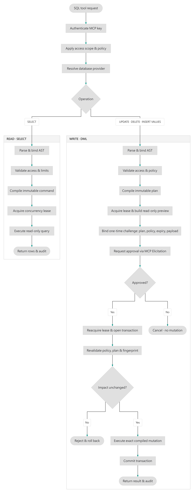

# hs-sql-agent

> **A high-performance MCP server for secure SQL access and enterprise governance.**


[](https://github.com/tse-wei-chen/hs-sql-agent/blob/main/LICENSE) [](https://github.com/tse-wei-chen/hs-sql-agent/actions/workflows/docker-publish.yml) [](https://www.nuget.org/packages/HsSqlAgent.Server) [](https://github.com/tse-wei-chen/hs-sql-agent/actions/workflows/codeql.yml) [](https://github.com/tse-wei-chen/hs-sql-agent/actions/workflows/test.yml)

`hs-sql-agent` connects MCP clients to SQLite, PostgreSQL, MySQL, SQL Server, Oracle, and Firebird through an HTTP MCP endpoint. It can run as the complete first-party server with its Admin Panel, or be embedded into an existing ASP.NET Core application as composable capabilities.

## Why hs-sql-agent?

Instead of executing unrestricted LLM-generated SQL, the server parses supported SQL into structured definitions, validates it, and rebuilds the final statement through a provider-specific SQL compiler.

- **Six database providers** — SQLite, PostgreSQL, MySQL, SQL Server, Oracle, and Firebird.
- **Governed access** — Per-key database binding, table whitelisting, CORS, rate limits, and execution policies.
- **Safe DML** — Read-only impact preview, one-time approval challenge, commit-time row-set revalidation, and MCP Elicitation for explicit human approval.
- **Composable ASP.NET Core package** — Use only runtime, persistence, MCP, Admin API, built-in identity, or telemetry capabilities that your host actually needs.
- **Host-owned authentication supported** — Existing ASP.NET Core applications can keep their own Cookie/JWT/OIDC login, authorization policy, frontend, exception handling, and telemetry.
- **Admin Panel** — Manage databases, keys, roles, custom tools, audit records, and runtime policies when the packaged UI and built-in identity are desired.
- **Enterprise ready** — OIDC SSO, TOTP MFA, audit retention, Prometheus metrics, OTLP, and webhook/SIEM delivery.
- **Semantic metadata** — Table and column synonyms, relationships, and scoped metric metadata for schema discovery.

SQL support is intentionally bounded: unsupported syntax is rejected instead of silently changing its meaning. See the [SQL Support Reference](https://sql-agent.net/en/docs/sql-compiler/sql-support) for the supported SQL contract.

## Quick Start

```bash
cp .env.example .env
# Set HMAC_KEY and JWT_KEY to unique secrets of at least 32 bytes.
docker compose up -d
```

Open the Admin Panel at <http://localhost:8080>. See [Configuration](https://sql-agent.net/en/docs/operations/configuration) for runtime settings and [Deployment](https://sql-agent.net/en/docs/operations/deployment) for production guidance.

## Use with an MCP client

Set `MCP_PUBLIC_ENDPOINT` to the externally reachable MCP URL, including `/mcp`, before issuing production keys.

Then open **Runtime → MCP Keys** in the Admin Panel and issue a key. The one-time **Save and connect** dialog displays the plaintext secret and generates ready-to-paste configuration for **Claude Desktop, Cursor, Visual Studio Code, and generic Streamable HTTP clients**. Choose the client tab, click its **Copy ... config** button, and paste the copied JSON into that MCP client.

The plaintext secret is not stored and cannot be shown again after the dialog closes. Rotate or duplicate the key to obtain a new secret and generated configuration. For client compatibility, onboarding, and DML Elicitation requirements, see [MCP Client Onboarding](https://sql-agent.net/en/docs/mcp/client-onboarding).

## NuGet for existing .NET APIs

Install the ASP.NET Core package:

```bash
dotnet add package HsSqlAgent.Server
```

New integrations start with an optionless core and select only the capabilities they need:

```csharp
using HsSqlAgent.Server.Extensions;

var hs = builder.Services.AddHsSqlAgentCore();

hs.AddHsSqlAgentRuntime();

hs.AddHsSqlAgentAdminStore(options =>
{
    options.Provider = "Postgres";
    options.ConnectionString = builder.Configuration.GetConnectionString("HsSqlAgent")!;
});
```

### Existing application with its own login and permissions

You do **not** need to mount the HsSqlAgent frontend or use the HsSqlAgent member/role/JWT model. Keep the host application's existing authentication and authorization and delegate HsSqlAgent permission checks to one host policy:

```csharp
builder.Services.AddAuthentication(/* existing host schemes */);
builder.Services.AddAuthorization(options =>
{
    options.AddPolicy("SqlAgentAdmin", policy =>
    {
        // Add the host application's own requirement/handler.
        // Handlers may inspect HsSqlAgentPermissionResource.Permissions.
    });
});

var hs = builder.Services.AddHsSqlAgentCore();

hs.AddHsSqlAgentRuntime();
hs.AddHsSqlAgentAdminStore(options =>
{
    options.Provider = "Postgres";
    options.ConnectionString = builder.Configuration.GetConnectionString("HsSqlAgent")!;
});
hs.AddHsSqlAgentHostAuthorization("SqlAgentAdmin");
hs.AddHsSqlAgentAdminApi();

var app = builder.Build();
app.UseAuthentication();
app.UseAuthorization();
app.UseHsSqlAgentAdminApi();
app.MapControllers();
app.Run();
```

In this mode HsSqlAgent does not publish its built-in `AuthController`, `MemberController`, or `RoleController`, does not install its identity schema, and does not require JWT, SMTP, OIDC, MCP, or telemetry configuration unless those capabilities are explicitly selected.

If the same host also wants the MCP endpoint, add it independently:

```csharp
hs.AddHsSqlAgentMcp(options =>
{
    options.PublicEndpoint = "https://example.com/mcp";
    options.HmacSecretKey = builder.Configuration["HMAC_KEY"]!; // at least 32 bytes
});

// after builder.Build()
app.UseHsSqlAgentMcp();
```

MCP access keys are a separate machine-access security boundary from human/admin authorization.

### Standalone / packaged Admin experience

Applications that want the HsSqlAgent JWT/member/role model and Admin API can opt into built-in identity explicitly:

```csharp
var hs = builder.Services.AddHsSqlAgentCore();

hs.AddHsSqlAgentRuntime();
hs.AddHsSqlAgentAdminStore(options =>
{
    options.Provider = "Sqlite";
    options.ConnectionString = "Data Source=hsagent.db";
});
hs.AddHsSqlAgentBuiltInAuth(options =>
{
    options.Jwt.SecretKey = builder.Configuration["JWT_KEY"]!;
});
hs.AddHsSqlAgentMcp(options =>
{
    options.PublicEndpoint = "http://localhost:8080/mcp";
    options.HmacSecretKey = builder.Configuration["HMAC_KEY"]!;
});
hs.AddHsSqlAgentAdminApi();
hs.AddHsSqlAgentTelemetry();

var app = builder.Build();
app.UseHsSqlAgentMcp();
app.UseHsSqlAgentAdminApi();
app.MapControllers();
app.UseHsSqlAgentAdminUi();
app.Run();
```

Built-in identity and host-authorization mode are mutually exclusive. HsSqlAgent-owned authentication schemes are namespaced and do not replace the host application's default authentication schemes or default authorization policy.

### Capability-owned configuration

| Capability | Configuration it owns |
|---|---|
| `AddHsSqlAgentRuntime()` | Bootstrap, operability, cache, rate limiting, security-policy sync, outbound-delivery sync, SQL concurrency, DML approval store |
| `AddHsSqlAgentAdminStore()` | Admin database provider and connection string |
| `AddHsSqlAgentBuiltInAuth()` | JWT, password reset/SMTP, enterprise identity/OIDC |
| `AddHsSqlAgentHostAuthorization()` | Delegation to an existing ASP.NET Core authorization policy |
| `AddHsSqlAgentMcp()` | Public MCP endpoint and MCP-key HMAC secret |
| `AddHsSqlAgentAdminApi()` | HsSqlAgent administration controllers and scoped validation/exception behavior |
| `AddHsSqlAgentTelemetry()` | Prometheus and OTLP exporters |

Unselected capabilities do not allocate or validate their options. Existing defaults are preserved by the modular API, including SQLite admin storage, Memory-backed runtime stores, fail-closed rate/concurrency modes, JWT issuer/audience defaults, Prometheus defaults, key prefixes, timeouts, and leases.

The legacy aggregate API remains available for existing package consumers:

```csharp
builder.Services.AddHsSqlAgent(options => { /* existing aggregate configuration */ });
app.UseHsSqlAgent();
// app.UseHsSqlAgent().ServeAdminUi();
```

For new integrations, prefer the modular API above. See the package-specific [HsSqlAgent.Server README](backend/src/Modules/HsSqlAgent.Server/README.md) and the [ASP.NET Core Integration guide](https://sql-agent.net/en/docs/integration/aspnet-core) for more details.

### Current HTTP surface contract

The currently supported public mounts are intentionally fixed:

- MCP: `/mcp`
- Admin API: `/api`
- Admin UI: `/`

Canonical permission paths such as `/auth/role` and `/runtime/db-management` are authorization resource identifiers, not HTTP or frontend navigation paths.

## How SQL execution works

1. Authenticate the MCP key and apply its database, table, and policy scope.
2. Parse supported SQL into a structured definition.
3. Validate the definition and compile it for the configured database provider.
4. Execute queries within configured limits.
5. For DML, build a read-only impact preview, bind approval to the validated plan and matched row set, require human approval through MCP Elicitation, then revalidate inside the commit transaction before executing the mutation.

Custom SQL tools pass through the same parser, validation, access policy, and execution limits as built-in tools. Lifecycle, parameter, and publishing rules are documented in [Custom Tools](https://sql-agent.net/en/docs/administration/custom-tools).

## Documentation

| Topic | Documentation |
|---|---|
| Getting started | [Quick Start](https://sql-agent.net/en/docs/getting-started/quick-start) |
| Configuration | [Configuration Reference](https://sql-agent.net/en/docs/operations/configuration) |
| Admin Panel | [Admin Panel Overview](https://sql-agent.net/en/docs/administration/overview) |
| MCP tools and SQL support | [MCP Tools Reference](https://sql-agent.net/en/docs/mcp/tools-reference) · [SQL Support Reference](https://sql-agent.net/en/docs/sql-compiler/sql-support) |
| Security, OIDC, and MFA | [Security Overview](https://sql-agent.net/en/docs/security/overview) · [OIDC SSO and TOTP MFA](https://sql-agent.net/en/docs/security/oidc-mfa) |
| Deployment and observability | [Deployment](https://sql-agent.net/en/docs/operations/deployment) · [Distributed Deployment](https://sql-agent.net/en/docs/operations/distributed-deployment) · [Observability](https://sql-agent.net/en/docs/operations/observability) |
| API | [Admin HTTP API Reference](https://sql-agent.net/en/docs/reference/api-reference) |
| Troubleshooting | [Troubleshooting](https://sql-agent.net/en/docs/reference/troubleshooting) |
| Development | [Architecture and Contribution Flow](https://sql-agent.net/en/docs/development/architecture) |

## SQL Execution Flow

<picture>
  <source media="(prefers-color-scheme: dark)" srcset="miscellaneous/diagram-black.png">
  <source media="(prefers-color-scheme: light)" srcset="miscellaneous/diagram-light.png">
  
</picture>

### DML Approval Prompt

This is what the human-in-the-loop approval step looks like during `execute_dml_sql`:


## Contributing

See [CONTRIBUTING.md](CONTRIBUTING.md) and the [Architecture and Contribution Flow](https://sql-agent.net/en/docs/development/architecture).

## License

[Apache License 2.0](LICENSE)
