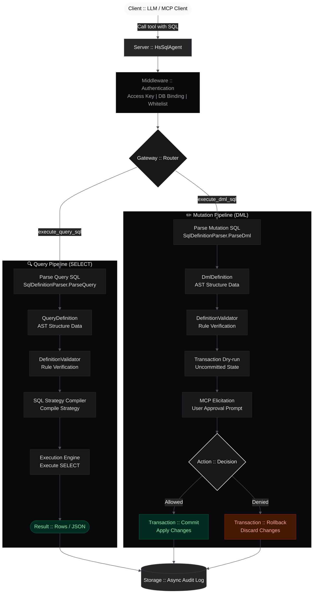

# hs-sql-agent
> **The high-performance MCP server for instant SQL interaction and secure enterprise governance.**


[](https://github.com/tse-wei-chen/hs-sql-agent/blob/main/LICENSE) [](https://github.com/tse-wei-chen/hs-sql-agent/actions/workflows/docker-publish.yml) [](https://www.nuget.org/packages/HsSqlAgent.Server) [](https://github.com/tse-wei-chen/hs-sql-agent/actions/workflows/codeql.yml) [](https://github.com/tse-wei-chen/hs-sql-agent/actions/workflows/test.yml) [](https://zeabur.com/templates/RFPWDU)

`hs-sql-agent` is an HTTP MCP server for relational databases (SQLite, PostgreSQL, MySQL, SQL Server, Oracle, Firebird) with a built-in Admin Panel for governance.

## 🤔 Why hs-sql-agent?

Most "Chat with your Data" tools ask the LLM to write raw SQL — a recipe for hallucinations, dialect confusion, and injection risks. **hs-sql-agent takes a structured approach**: the AI can write SQL, the server parses it into structured definitions, validates the result, and rebuilds the final query through the SQL builder before execution. Zero hallucinated syntax, zero direct string injection into the database.

- **Structured SQL Pipeline** — The AI can write SQL, but the server parses it into structured definitions, validates it, and rebuilds the final query through the SQL builder before execution.
- **Universal DB Support** — One agent for SQLite, PostgreSQL, MySQL, SQL Server, Oracle, and Firebird. The same MCP endpoint switches engines transparently.
- **Enterprise Governance** — Built-in Admin Web UI, key-level connection mapping, table whitelisting, per-key CORS, rate limiting, and full audit logs.
- **Semantic Layer** — Map cryptic legacy column names to business-friendly labels so the LLM understands your schema.

### Where to use it

| Use case | Description |
|----------|-------------|
| **Cursor / Claude Desktop** | Let devs query dev/test DBs in natural language from their AI IDE. |
| **Multi-DB agents** | One MCP server per database, each secured with its own API key. The agent aggregates multiple MCP connections to seamlessly orchestrate workflows across PostgreSQL, MySQL, and Oracle. |
| **Enterprise chatbots** | Connect internal AI agents to ERP/CRM systems with table-level permission isolation. |
| **Legacy modernization** | Bridge modern AI to decades-old databases via the semantic layer. |

## 🚀 Quick Start

```bash
cp .env.example .env      # set HMAC_KEY and JWT_KEY (32+ bytes)
docker compose up -d       # http://localhost:8080
```

## 📦 NuGet for Existing .NET APIs

Already have an ASP.NET Core API? Embed the full MCP SQL Agent + Admin UI in minutes:

```bash
dotnet add package HsSqlAgent.Server
```

```csharp
builder.Services.AddHsSqlAgent(options => { ... });
app.UseHsSqlAgent();                    // API-only
// app.UseHsSqlAgent().ServeAdminUi();  // with Admin UI
```

> The Admin UI is embedded in the DLL — no external files to deploy. See the [NuGet Package guide](https://github.com/tse-wei-chen/hs-sql-agent/wiki/NuGet-Package) for details.

## 📖 Documentation

Detailed docs are on the [Wiki](https://github.com/tse-wei-chen/hs-sql-agent/wiki):

| Topic | Link |
|-------|------|
| 🚀 Getting Started | [Getting-Started](https://github.com/tse-wei-chen/hs-sql-agent/wiki/Getting-Started) |
| ✨ Features | [Features](https://github.com/tse-wei-chen/hs-sql-agent/wiki/Features) |
| 📘 MCP Tools | [MCP-Tools-Reference](https://github.com/tse-wei-chen/hs-sql-agent/wiki/MCP-Tools-Reference) |
| 🖥️ Admin Panel | [Admin-Panel](https://github.com/tse-wei-chen/hs-sql-agent/wiki/Admin-Panel) |
| ⚙️ Configuration | [Configuration](https://github.com/tse-wei-chen/hs-sql-agent/wiki/Configuration) |
| 🐳 Deployment | [Deployment](https://github.com/tse-wei-chen/hs-sql-agent/wiki/Deployment) |
| 🏠 Development | [Development](https://github.com/tse-wei-chen/hs-sql-agent/wiki/Development) |
| 📡 API Reference | [API-Reference](https://github.com/tse-wei-chen/hs-sql-agent/wiki/API-Reference) |
| ❓ FAQ | [FAQ](https://github.com/tse-wei-chen/hs-sql-agent/wiki/FAQ) |

## SQL Execution Flow



### DML Approval Prompt

This is what the human-in-the-loop approval step looks like during `execute_dml_sql`:


## 🤝 Contributing

See [CONTRIBUTING.md](CONTRIBUTING.md) and the [Development](https://github.com/tse-wei-chen/hs-sql-agent/wiki/Development) wiki page.

## 📜 License

[Apache License 2.0](LICENSE)
