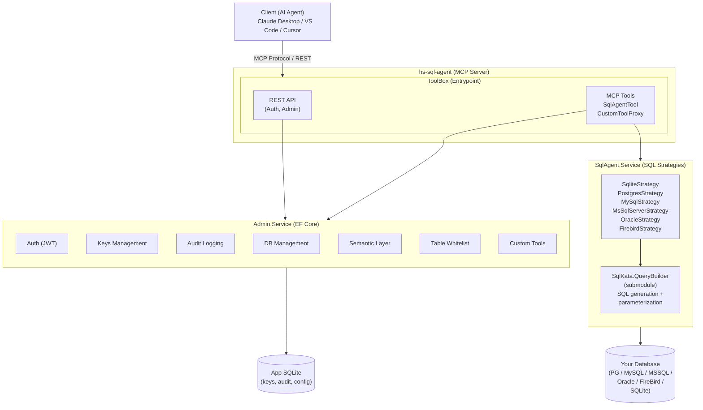

# 🏗️ Architecture

## High-Level Overview



## Technology Stack

### Backend

| Component         | Technology                        |
| ----------------- | --------------------------------- |
| Runtime           | .NET 10.0                         |
| Web Framework     | ASP.NET Core                      |
| MCP Protocol      | ModelContextProtocol.AspNetCore   |
| ORM               | EF Core 10.0 (SQLite)             |
| Query Builder     | SqlKata (forked submodule)        |
| Auth              | JWT Bearer + BCrypt               |
| Validation        | FluentValidation                  |
| Encryption        | AesGcm                            |
| Testing           | xUnit v3 + Testcontainers         |

### Frontend

| Component    | Technology        |
| ------------ | ----------------- |
| Framework    | Nuxt 4 (SPA mode) |
| UI           | Vue 3 + shadcn-vue|
| Styling      | Tailwind CSS 4    |
| Forms        | VeeValidate       |
| Icons        | Lucide            |
| Code Editor  | CodeMirror        |
| Flow Charts  | Vue Flow          |
| Charts       | Unovis            |
| HTTP Client  | Xior              |
| Testing      | Vitest + happy-dom|

### Storage

| Data                  | Storage      |
| --------------------- | ------------ |
| App Database          | SQLite       |
| User Databases        | Any supported|
| Volume Mount          | `./data/`    |

## Project Structure

```
hs-sql-agent/
├── backend/
│   └── src/
│       ├── Common/                 # Shared interfaces & services
│       ├── Infrastructure/         # Placeholder (currently empty/unused)
│       ├── Modules/
│       │   ├── Admin.Service/      # Admin panel: EF context, auth,
│       │   │                       #   key mgmt, audit, semantic layer
│       │   ├── SqlAgent.Service/   # SQL strategies for 6 databases
│       │   └── SqlKata.Service/    # Forked SqlKata QueryBuilder
│       ├── ToolBox/                # Entrypoint: Program.cs, Controllers,
│       │                          #   Middleware, MCP Tools, wwwroot
│       └── UnitTest/
│           ├── Admin.Test/         # Unit tests (Moq)
│           └── SqlAgent.Test/      # Integration tests (Testcontainers)
├── frontend/
│   ├── app/                        # Nuxt source dir (srcDir)
│   │   ├── pages/                  # Route pages
│   │   ├── components/             # Vue components
│   │   ├── api/                    # API client modules
│   │   └── ...
│   ├── nuxt.config.ts
│   └── package.json
├── docker-compose.yml
├── Dockerfile
└── hs-sql-agent.wiki/              # This wiki (git submodule)
```

## Request Flow

### MCP Request Flow

```
Client → /mcp
  → Rate Limiter (IP-based, global)
  → McpAccessKeyAuthMiddleware (validate X-MCP-Server-Key)
  → McpStringifiedArrayMiddleware (handle array format)
  → MCP Server (dynamic tool injection per session)
    → Execute tool (SqlAgent or CustomTool)
      → Audit logging (background)
      → Update key last-used timestamp (background)
```

### REST API Flow

```
Client → /api/*
  → CORS (dev only)
  → JWT Authentication
  → Authorization (access token claim)
  → Controller
    → Admin Service
      → EF Core / SQLite
```

## Key Design Decisions

- **SqlKata for SQL generation** — deterministic, parameterized SQL generation eliminates LLM hallucination of raw SQL
- **Dynamic tool injection** — each MCP session gets a filtered tool list based on key permissions + custom tools
- **AesGcm encryption** — database connection strings are encrypted at rest
- **Background services** — audit logs and key last-used timestamps are written asynchronously to avoid blocking MCP requests
- **SPA frontend** — Nuxt 4 with SSR disabled, served as static files from the backend
